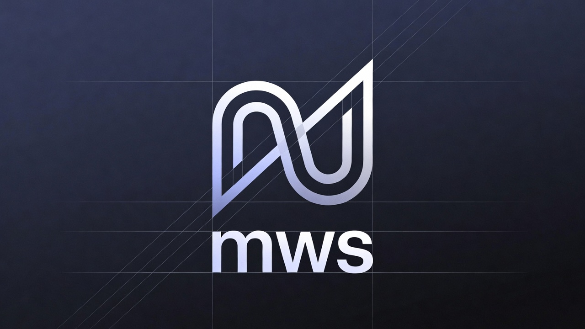

<div align="center">
  
</div>

## What Is mws?

A small Go CLI for managing **meta workspaces** -- a directory layout that wraps one or more native git repos with a shared AI-harness layer and cheap parallel working copies.

1. `mws init my-project` creates a meta workspace: a git repo at the root with the harness under `.mws/` and a first working copy at `main/`.
2. `mws add-repo <url>` registers a native repo and clones it into every working copy.
3. `mws clone <peer>` spins up another working copy that shares the same harness via symlinks, with its own independent native git clones inside.

The result: parallel agents work side-by-side without fighting over the same `.git/`, and changes to the shared harness propagate via symlinks instead of branch syncs.

## Prerequisites

- [Go](https://go.dev/) 1.24+ -- to install the CLI
- [Git](https://git-scm.com/) -- the meta workspace and every native repo are git repositories

## Install

```bash
go install github.com/sustinbebustin/mws/cmd/mws@latest
```

The harness skeleton ships embedded in the binary -- no separate template repo, no network at `init` time.

## Quick start

1. Create a meta workspace.

```bash
cd ~/dev
mws init my-project
cd my-project
```

2. Register one or more native repos. Each one is cloned into every working copy.

```bash
mws add-repo git@github.com:org/frontend.git
mws add-repo git@github.com:org/backend.git
```

3. Spin up a peer working copy alongside `main/` for parallel work.

```bash
mws clone feature-x
```

4. See what working copies exist.

```bash
mws list
```

## Layout

```
my-project/                       # this directory IS a git repo (meta root)
├── .gitignore                    # allowlist
├── .mws.toml                     # Project name, native repos, env mappings
├── .mws/                         # Harness; every entry symlinks into every working copy
│   ├── CLAUDE.md
│   ├── .claude/
│   ├── .workspace/
│   └── justfile
├── .envs/                        # Env-file staging, per repo (untracked)
├── main/                         # First working copy (untracked)
│   ├── frontend/                 # Independent native git clone
│   ├── backend/                  # Independent native git clone
│   ├── CLAUDE.md -> ../.mws/CLAUDE.md
│   ├── .claude/   -> ../.mws/.claude/
│   └── ...
└── feature-x/                    # Additional working copy
    ├── frontend/                 # Independent clone (own .git/)
    └── ...
```

Every top-level entry under `.mws/` is symlinked into each working copy -- discovered dynamically, no hardcoded list. New files created directly in a working copy stay local until `mws promote <path>` moves them into `.mws/` and backfills the symlink across every peer.

## Commands

| Command | What it does |
|---|---|
| `mws init [name]` | Create a new meta workspace with a first working copy at `<name>/main/`. |
| `mws add-repo <url> [folder]` | Register a native repo in `.mws.toml` and clone it into every working copy. |
| `mws clone <name>` | Create a new working copy. Native repos use `git clone --local` from a peer when possible (hardlinked objects), falling back to the configured URL. Each repo is checked out on its default branch. |
| `mws promote <path>` | Move a top-level file or directory from the current working copy into `.mws/`, symlink it back, and backfill the symlink into every other working copy. |
| `mws list` | List working copies in the current meta workspace. |
| `mws rm <name>` | Remove a working copy. Confirms before destruction. |
| `mws relink` | Refresh harness symlinks across every working copy; handles diverged content interactively. |
| `mws sync-env [name]` | Copy staged env files from `.envs/` into a working copy (overwrites). |
| `mws stage-env [name]` | Inverse of `sync-env`: capture a working copy's env files into staging as the new default. |
| `mws migrate <path>` | Convert an old sibling-meta layout to meta-at-root. |

## Configuration

The meta workspace's `.mws.toml` lists the native repos, optional env-file mappings, and optional setup commands. `mws clone` reads it to know what to clone, copy, and run.

```toml
project_name = "my-project"

[[repos]]
  folder = "frontend"
  url    = "git@github.com:org/frontend.git"

  [[repos.envs]]
    source = "apps-internal.env"      # staged at .envs/frontend/apps-internal.env
    target = "apps/internal/.env"     # copied here inside the clone

  [[repos.setup]]
    cmd = "pnpm install --frozen-lockfile"
  [[repos.setup]]
    cmd = "pnpm build"
```

On `mws clone`:

- **Env files** are copied (not symlinked) into the new working copy at their target paths, so peers can hold different ports or service keys. `.envs/` is allowlist-gitignored -- secrets stay local. `mws sync-env` re-pushes staged defaults; `mws stage-env` captures the current working copy back into staging.
- **Setup commands** run via `sh -c` from the cloned repo's directory after env-copy completes. You are prompted before any run; `--setup` skips the prompt, `--no-setup` skips execution.

Full schema and rationale: [`docs/config.md`](./docs/config.md).

## Development

```bash
go build ./...
go test ./...
go install ./cmd/mws
```

The skeleton lives at [`skeleton/`](./skeleton). Edits there ship in the next binary build.
